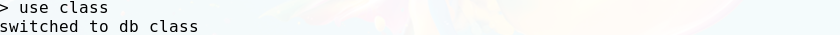

### question1
commond lines: ```> use class //create db class```   
screen shot:
<center>

</center>

### question2
command lines: 
```
> use class     //switch to db class
> db.createCollection("students")       //create collection students
> db.students.insert(       
    //insert the first student to collection "students"
  {
      "name" : "Zhixiang",
      "address" : "Suzhou",
      "age" : 20,
  })
> db.students.insert(
    //insert the second student to collection "students"
  {
      "name" : "Jinping",
      "address" : "Beijing",
      "age" : 23,
  })
```
screen shot:

### question3
command lines:
```
> use class  //switch to db "class"
> db.students.find({"address":"Beijing"})   //find objects without updating
> db.students.update({"address":"Beijing"},{$set:{"address":"Suzhou"}},{multi:true})
//updates all students whose address is Beijing with Suzhou
```
screen shot

### question4
command lines:
```
> use class
> db.students.find({},{"age":0,"_id":0})
```

### question5
command lines:
```
> use class
> db.students.find({"age":{$lte:25, $gte:20}})
```
### question6
command lines:
```
> use class
> db.students.find().sort({"age":1}).limit(3)
```

### question7
command lines:
```
> use class
> db.students.createIndex({"name":1},{unique:true})
```

### question8
command lines:
```
> use class
> db.students.insert(
  {
        "name": "Jack Ma",
        "address": {
            "street": " 111 Ren'ai Road ",
            "city": "Suzhou",
            "state": "Jiansu"
        }
  })
> db.students.ensureIndex({"address.street":1,"address.city":1,"address.state":1})
> db.students.find({"name":"Jack Ma", "address.city":"Suzhou"})
